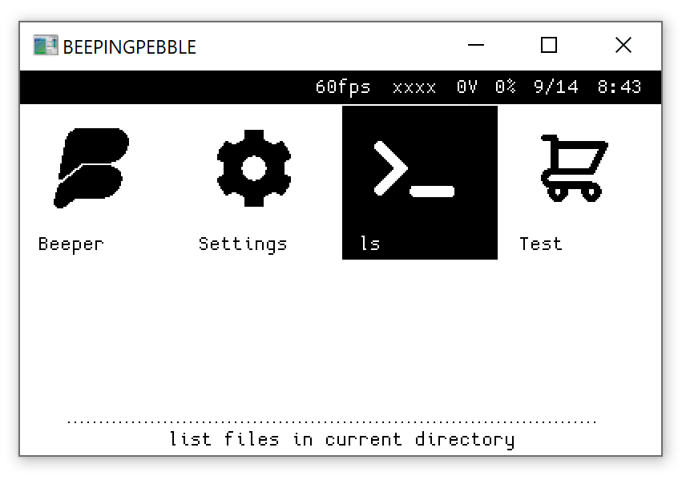

# BEEPINGPEBBLE



A launcher for the beepy (formerly beepberry) with a pebble watch PebbleUI inspiration

## About

The launcher is written in V, which is a transpiled-to-C-then-compiled-to-binary language which minimizes battery usage and increases speed.

Features:

- [ ] launch on hotkey press
- [x] load app config from text file
- [x] launch apps (untested)
- [x] Battery status
- [x] WIFI status
- [x] Light/Dark mode
- [x] custom graphics library with custom b/w primitives and bmfont support
- [x] rasterized text to avoid anti-aliased "soft" text
- [ ] 30/60fps (currently ~60fps with 3% cpu usage on rpi zero 2)
- [ ] vsync (untested)
- [x] direct framebuffer writing
- [x] framebuffer emulation for development on windows & linux
- [x] config file

## Install

0 Dependencies.

_Coming Soon_

## Documentation

Try it out yourself:

```
curl https://raw.githubusercontent.com/phcreery/beepingpebble/master/beepingpebble --output beepingpebble
chmod +x beepingpebble
./beepingpebble
```

Configuration is stored at `~/.config/beepingpebble/`. See `.beepingpebble/config.toml` for configuration options.

Applications are stored as desktop entry files in `~/.config/beepingpebble/apps/`. To add apps, simply create or copy desktop entry files. Note: see `icons` folder to list available icons

## Developing

Framebuffer emulation on Windows/Mac/Linux:

```
v -d emu run .
v -d emu -profile profile.txt -keepc -showcc run .
v -d emu -printfn blit -o ./dbg.c .
```

Dev on pi

```
v run .
```

Build for Pi (note, this has to be run raspberry pi zero hardware):

```
v -prod .
```
